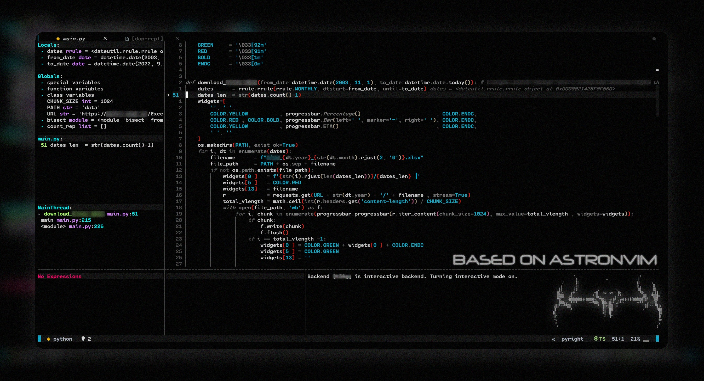

## My neovim set-up


This is just another neovim set-up. Everything you need to know about this setup is located inside the `init.lua` file itself at the momment :P, pretty cool stuff not gonna lie lol.


## Installation
### Linux
* [Install AstroNvim](https://github.com/AstroNvim/AstroNvim#%EF%B8%8F-installation) and [create a user profile](https://astronvim.github.io/configuration/manage_user_config)
* Open your terminal and run:
```terminal
curl -o ~/.config/nvim/lua/user/init.lua https://raw.githubusercontent.com/GiorgosXou/our-neovim-setup/main/init.lua
```
* Run `nvim +PackerSync` and you are done.


### Windows
* [Install AstroNvim and create a user profile]( https://github.com/GiorgosXou/Random-stuff/blob/main/Notes/note3.md)
* Open the [Terminal-App](https://apps.microsoft.com/store/detail/windows-terminal/9N0DX20HK701) *(PowerShell)* and run:
```terminal
curl.exe -o $env:userprofile\.config\nvim\lua\user\init.lua https://raw.githubusercontent.com/GiorgosXou/our-neovim-setup/main/init.lua
```
* Run `nvim +PackerSync` and you are done.

