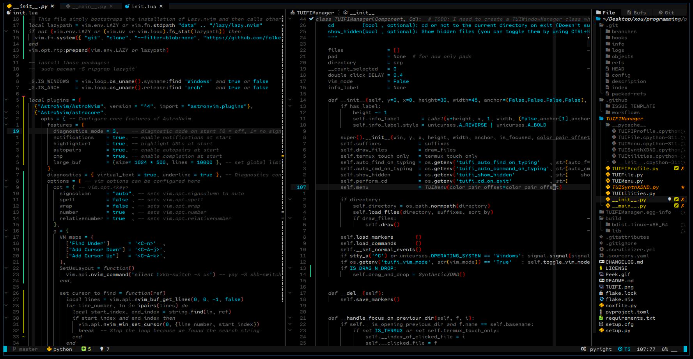

## My neovim set-up


This is just a neovim set-up powered by [AstroNvim](https://github.com/AstroNvim/AstroNvim). Everything you need to know about this setup is located inside the `init.lua` file itself at the moment :P, pretty cool stuff not gonna lie lol.


## Installation
### Linux
* [Install AstroNvim](https://github.com/AstroNvim/AstroNvim#%EF%B8%8F-installation) 
* Open your terminal and run:
```terminal
curl -o ~/.config/nvim/init.lua https://raw.githubusercontent.com/GiorgosXou/our-neovim-setup/main/init.lua
```

### Windows
* [Install AstroNvim for windows]( https://github.com/GiorgosXou/Random-stuff/blob/main/Notes/note3.md)
* Open the [Terminal-App](https://apps.microsoft.com/store/detail/windows-terminal/9N0DX20HK701) *(PowerShell)* and run:
```terminal
curl.exe -o $env:userprofile\.config\nvim\init.lua https://raw.githubusercontent.com/GiorgosXou/our-neovim-setup/main/init.lua
```

# 

<sup>
<sub>
Or be me and clone like this: `cd ~/.config/nvim/ && git clone https://github.com/GiorgosXou/our-neovim-setup && mv ./our-neovim-setup/{*,.*} ./ && rm -r ./our-neovim-setup`
</sub>
</sup>
